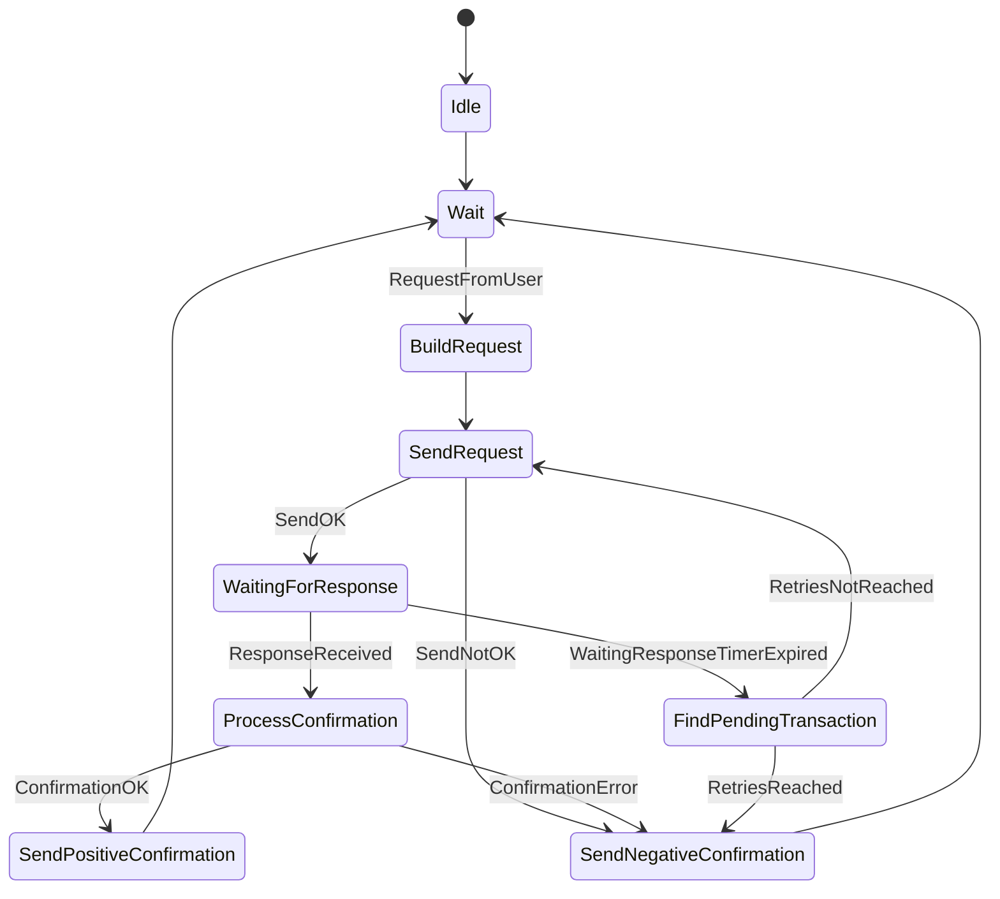
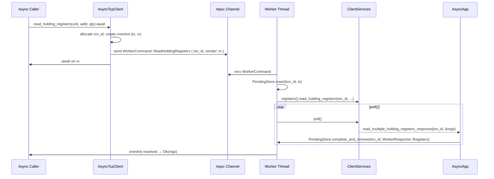

# Modbus-rs Architecture Overview

This document provides a high-level overview of the `modbus-rs` library's architecture, focusing on its core components and their interactions. The library is designed for `no_std` compatibility, offering a robust and flexible Modbus client implementation suitable for embedded systems.

## Core Components

The `modbus-rs` ecosystem is composed of several crates, each with a distinct responsibility:

-   **`mbus-core`**: Provides fundamental Modbus data structures, error types, and the `Transport` trait for abstracting communication layers.
-   **`mbus-client`**: Implements the Modbus client state machine and services for handling various Modbus function codes.
-   **`mbus-network`**: Provides the standard TCP transport implementation (`StdTcpTransport`).
-   **`mbus-serial`**: Provides standard Serial transport implementations (`StdSerialTransport`) for RTU/ASCII modes.

At the top-level `modbus-rs` crate, serial transport exposure is split into two user-facing
features:

-   **`serial-rtu`**: Enables serial transport for RTU-oriented builds.
-   **`serial-ascii`**: Enables serial transport for ASCII-oriented builds.

## Modbus TCP Client State Machine

The client activity flow for Modbus TCP is defined by a deterministic state machine, adhering to "MODBUS Messaging on TCP/IP Implementation Guide V1.0b" Figure 11: *MODBUS Client Activity Diagram*. This state machine describes the lifecycle of a single transaction in a sequential (non-concurrent) Modbus TCP client.

### Design Goals

-   **Deterministic**: Predictable behavior for reliable operation.
-   **Transport-agnostic**: Decoupled from the underlying communication medium.
-   **Bare-metal friendly**: Designed for resource-constrained environments.
-   **Suitable for `poll()`-driven execution**: Enables non-blocking operation.
-   **Easily extensible for retry logic**: Facilitates robust communication.

### Overview

The client operates in a loop, managing the following steps for each transaction:

1.  Waiting for user request.
2.  Building the MODBUS request.
3.  Sending the request to the TCP management layer.
4.  Waiting for a response (with a configurable timeout).
5.  Processing the confirmation.
6.  Returning the result to the user.

Retry logic is applied if a timeout occurs.

### State Diagram



### State Descriptions

-   **Idle**: The initial state, indicating no active transaction.
-   **Wait**: The client is awaiting a user request, a TCP response, or a response timeout.
-   **BuildRequest**: The Modbus PDU is constructed and wrapped into an ADU.
-   **SendRequest**: The constructed request is sent to the TCP transport layer.
-   **WaitingForResponse**: A response timer is active, and the client is awaiting confirmation from the server.
-   **ProcessConfirmation**: The received response is parsed and validated.
-   **FindPendingTransaction**: Triggered by a response timeout, this state determines if a retry is allowed based on the retry logic.
-   **SendPositiveConfirmation**: A successful result is sent to the user application.
-   **SendNegativeConfirmation**: A failure result is sent to the user application.

## Transport Layer (`mbus-core/src/transport/mod.rs`)

The transport layer provides abstractions for transmitting Modbus Application Data Units (ADUs) over various physical and logical mediums.

### Core Concepts

-   **`Transport` Trait**: A unified interface that abstracts the underlying communication (TCP, Serial, or Mock) from the high-level protocol logic. Implementors are responsible for connection management, framing, sending, and receiving data.
-   **`ModbusConfig`**: A comprehensive configuration enum for setting up TCP/IP or Serial (RTU/ASCII) parameters.
-   **`UnitIdOrSlaveAddr`**: A type-safe wrapper for Modbus addresses, ensuring validity and explicitly handling broadcast addresses.

### Design Goals

-   **`no_std` Compatibility**: Utilizes `heapless` data structures and `core` traits for bare-metal embedded systems.
-   **Non-blocking I/O**: The `Transport::recv` interface is designed to be polled, allowing the client to remain responsive without requiring an OS-level thread.
-   **Extensibility**: Users can implement the `Transport` trait for custom hardware.

### Error Handling

Errors are categorized into `TransportError`, which can be seamlessly converted into the top-level `MbusError` used throughout the crate.

## Client Services (`mbus-client/src/lib.rs`)

The `mbus-client` crate provides the `ClientServices` struct, which acts as the central coordinator for Modbus transactions.

### Responsibilities

-   **Request Lifecycle Management**: Manages ADU construction, transmission, response tracking, timeouts, and retries.
-   **Pipelining**: Supports multiple concurrent outstanding requests (configurable via const generics).
-   **Reliability**: Built-in support for automatic retries and configurable response timeouts.
-   **Memory Safety**: Employs `heapless` for all internal buffering, eliminating dynamic allocation.
-   **Protocol Coverage**: Implements standard function codes for various Modbus operations.
-   **`App` Traits**: Defines traits (e.g., `CoilResponse`, `RegisterResponse`) that users implement to receive asynchronous callbacks when a response is parsed.

The `ClientServices` orchestrates the interaction between the state machine, the transport layer, and the application-specific response handlers.

## Async Layer (`mbus-async`)

The `mbus-async` crate is an async facade that sits on top of `mbus-client`. It does not replace the synchronous protocol core; instead, it bridges the poll-driven state machine to Tokio's async executor via a dedicated worker thread and Tokio oneshot channels.

### Design Philosophy

- The synchronous protocol stack (`mbus-core`, `mbus-client`) is unchanged.
- A background `std::thread` owns the `ClientServices` instance and drives it by calling `poll()` in a loop.
- Async callers communicate with the worker thread through a `std::sync::mpsc` channel of `WorkerCommand` values.
- Each command carries a Tokio `oneshot::Sender`. When the response arrives, the worker resolves that sender. The caller's `.await` point wakes up.
- Requests are tracked in a shared `PendingStore` (`HashMap<u16, oneshot::Sender>`), keyed by transaction id.

### Components

| Component | Role |
|---|---|
| `AsyncTcpClient` | Public async API for TCP connections |
| `AsyncSerialClient` | Public async API for RTU/ASCII serial connections |
| `AsyncApp` | Internal `mbus-client` app implementation; routes responses to the correct pending sender |
| `PendingStore` | Arc-Mutex map from transaction id to oneshot sender |
| `WorkerCommand` | Enum describing each possible request to the worker |
| `WorkerResponse` | Enum of typed parsed response values |
| `run_worker` | Worker loop: receives commands, drives `poll()`, manages shutdown |
| `handle_command` | Dispatches each `WorkerCommand` to the correct `ClientServices` sub-service |

### Concurrency model

```
async caller A  ──┐
async caller B  ──┤── mpsc::Sender<WorkerCommand> ──► Worker thread
async caller C  ──┘                                        │
                                                      ClientServices
                                                      poll() loop
                                                           │
                                              AsyncApp::response_callback()
                                                           │
                                             PendingStore::complete_and_remove()
                                                           │
                       ◄── oneshot resolved ───────────────┘
```

Multiple concurrent `.await` calls each get an independent transaction id and oneshot channel. The appropriate caller is woken when the worker fires the matching oneshot.

TCP pipeline depth is compile-time configurable through `AsyncTcpClient<const N: usize = 9>`,
which forwards `N` into `ClientServices<_, _, N>`. By default (`N = 9`), up to 9 requests can
be in flight before additional requests queue up in the mpsc channel. Serial defaults to
pipeline depth `1`, reflecting the half-duplex request/reply nature of Modbus serial.

### Request lifecycle



### Error propagation

- If `ClientServices` rejects the request synchronously (e.g. queue full), `PendingStore::fail_and_remove` is called immediately with the error.
- If the server returns a Modbus exception, `AsyncApp::request_failed` is called and the pending sender receives `Err(MbusError::ModbusException(...))`.
- If the worker thread panics or the mpsc channel is dropped, the caller receives `AsyncError::WorkerClosed`.

### Pipeline depth and const generic `N`

`run_worker` and `handle_command` are generic over the transport type and `const N: usize`, which is the pipeline size passed to `ClientServices<_, _, N>`. This allows the TCP path to use configurable pipeline depth (`N`, default 9 via `AsyncTcpClient`) and the serial path to use depth 1 while sharing the same worker implementation.
