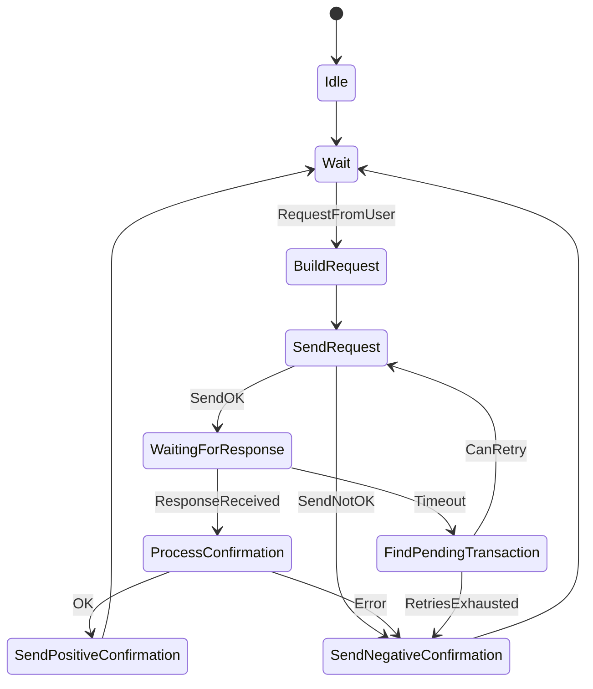

# Client Architecture

Understanding the internal design of the Modbus client stack.

---

## Overview

```
┌──────────────┐      ┌─────────────────────┐       ┌──────────────────┐
│  Your App    │─────▶│  ClientServices     │──────▶│  Transport       │
│              │      │  (mbus-client)      │       │  (mbus-network / │
│  poll() loop │◀─────│  request queue,     │       │   mbus-serial)   │
│  callbacks   │      │  retry scheduler,   │       └──────────────────┘
│  TimeKeeper  │      │  timeout tracking   │
└──────────────┘      └─────────────────────┘
                               │
                               ▼
                      ┌─────────────────────┐
                      │  mbus-core          │
                      │  protocol types,    │
                      │  ADU/PDU framing,   │
                      │  error model        │
                      └─────────────────────┘
```

---

## Design Principles

| Principle | Implementation |
|-----------|----------------|
| **No heap allocation** | All buffers use `heapless` with compile-time capacity |
| **No internal threads** | Progress driven entirely by `poll()` calls |
| **No blocking I/O** | Transport `recv()` is non-blocking |
| **Transport-agnostic** | Swap TCP/Serial/Mock via generic parameter |
| **no_std compatible** | Core library works on bare-metal |

---

## Crate Responsibilities

### `mbus-core`

- Protocol types: `FunctionCode`, `ExceptionCode`, `Pdu`, `Adu`
- Transport trait definition
- Config structs: `ModbusTcpConfig`, `ModbusSerialConfig`
- Error types: `MbusError`
- Wire encoding/decoding

### `mbus-client`

- `ClientServices` — request lifecycle orchestrator
- Request queue with configurable depth (const generic)
- Response matching and callback dispatch
- Timeout tracking and retry scheduling
- Function code service facades (`.coils()`, `.registers()`, etc.)

### `mbus-network`

- `StdTcpTransport` — TCP transport using `std::net::TcpStream`

### `mbus-serial`

- `StdRtuTransport` — Serial RTU transport
- `StdAsciiTransport` — Serial ASCII transport
- Both use the `serialport` crate

### `mbus-async`

- `AsyncTcpClient` — Tokio async wrapper
- `AsyncSerialClient` — Tokio async wrapper
- Spawns internal poll task

---

## State Machine

The client implements the Modbus TCP Client Activity Diagram from the specification.



### States

| State | Description |
|-------|-------------|
| **Idle** | No active transaction |
| **Wait** | Awaiting user request, response, or timeout |
| **BuildRequest** | Constructing ADU from PDU |
| **SendRequest** | Transmitting to transport |
| **WaitingForResponse** | Response timer active |
| **ProcessConfirmation** | Parsing and validating response |
| **FindPendingTransaction** | Timeout occurred, checking retry budget |
| **SendPositiveConfirmation** | Success callback to app |
| **SendNegativeConfirmation** | Error callback to app |

---

## Transport Trait

```rust
pub trait Transport {
    type Error: Into<MbusError>;
    
    const TRANSPORT_TYPE: TransportType;
    const SUPPORTS_BROADCAST_WRITES: bool;
    
    fn connect(&mut self, config: &ModbusConfig) -> Result<(), Self::Error>;
    fn disconnect(&mut self) -> Result<(), Self::Error>;
    fn send(&mut self, frame: &[u8]) -> Result<(), Self::Error>;
    fn recv(&mut self) -> Result<Vec<u8, MAX_ADU_FRAME_LEN>, Self::Error>;
    fn is_connected(&self) -> bool;
}
```

### Transport Types

| Type | Value |
|------|-------|
| `StdTcp` | Standard TCP socket |
| `CustomTcp` | User-defined TCP |
| `StdSerial(mode)` | Standard serial port |
| `CustomSerial(mode)` | User-defined serial |

---

## Request Queue

`ClientServices<TRANSPORT, APP, const QUEUE_DEPTH: usize>` uses const generics for queue capacity.

```rust
// Support 4 concurrent outstanding requests
let client = ClientServices::<_, _, 4>::new(transport, app, config)?;

// Support 16 concurrent outstanding requests
let client = ClientServices::<_, _, 16>::new(transport, app, config)?;
```

Queue structure (per request):
- Transaction ID
- Target unit ID / slave address
- Function code
- Timestamp (for timeout tracking)
- Retry count
- PDU payload

---

## Backoff Scheduling

Retry delays are **timestamp-scheduled**, not blocking:

1. When a timeout occurs, next retry time is calculated
2. `poll()` checks `current_millis()` against scheduled retry time
3. If not due yet, `poll()` returns immediately (no blocking)
4. When due, request is re-sent

This allows mixing multiple requests with different retry schedules.

---

## Traffic Hook Path

When `traffic` feature is enabled:

```
                    ┌─────────────────┐
                    │  TrafficNotifier│
                    │  on_tx_frame()  │◄─── Called on send (success or fail)
                    │  on_rx_frame()  │◄─── Called on receive
                    │  on_tx_error()  │◄─── Called on send failure
                    │  on_rx_error()  │◄─── Called on protocol/timeout error
                    └─────────────────┘
```

---

## Memory Layout

All internal buffers are stack-allocated:

| Buffer | Size | Notes |
|--------|------|-------|
| ADU frame | 260 bytes | 513 bytes with `serial-ascii` |
| Request queue | `QUEUE_DEPTH * ~300 bytes` | Per outstanding request |
| Response buffer | 260 bytes | Shared |

---

## See Also

- [Building Applications](building_applications.md)
- [Policies](policies.md) — Retry and timeout configuration
- [Async Development](async.md) — Async wrapper architecture
