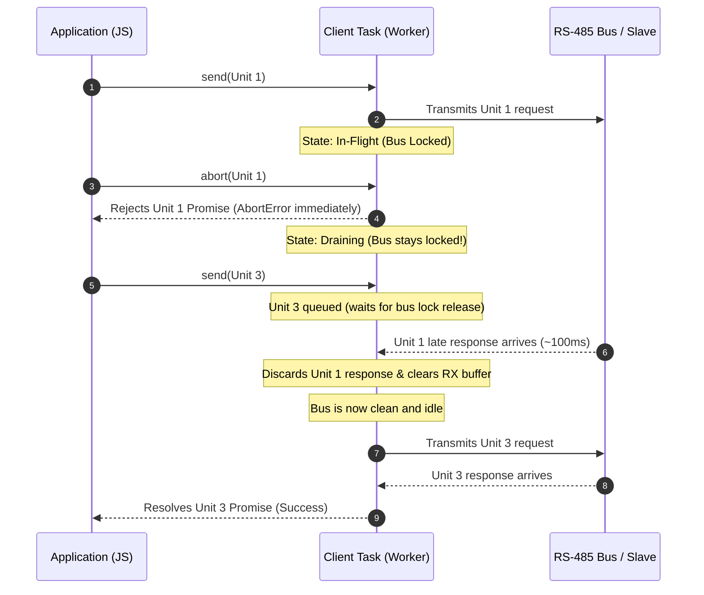

# Node.js Bindings

The Node.js bindings expose `modbus-rs` through a native addon built with
[napi-rs](https://napi.rs/) and published to npm as
[`modbus-rs`](https://www.npmjs.com/package/modbus-rs).

They follow the same native-binding architecture as the .NET and Go
bindings — a thin layer over the existing `mbus-client-async`,
`mbus-server-async`, and `mbus-gateway` crates with a single shared
Tokio runtime and opaque handles. The JavaScript surface is idiomatic
JS: classes with async methods, plain options objects, and JS errors.

No Modbus protocol logic is reimplemented in JavaScript. Requests flow
through:

```text
JS public API → #[napi] wrapper → async Rust crates → wire
```

## Status

Implemented:

| Class | Purpose | Notes |
|---|---|---|
| `AsyncTcpTransport` | Manage physical TCP connections | Factory for client handles |
| `AsyncRtuTransport` | Manage physical RTU serial port connections | Factory for client handles |
| `AsyncAsciiTransport` | Manage physical ASCII serial port connections | Factory for client handles |
| `AsyncTcpModbusClient` | Lightweight logical TCP client handle | Extracted from transport via `createClient()` |
| `AsyncSerialModbusClient` | Lightweight logical Serial RTU/ASCII client handle | Extracted from transport via `createClient()` |
| `AsyncTcpModbusServer` | Async Modbus TCP server | Drives request handling via JS handler callback dispatch |
| `AsyncTcpGateway` | Async Modbus TCP gateway with unit-ID routing | Routing table implemented |

## Building

You need Node.js ≥ 24.6 LTS and a working Rust toolchain. On Linux you also
need `libudev-dev` (Debian/Ubuntu) or `libudev-devel` (Fedora/RHEL) for
the serialport dependency.

```bash
# 1) Build the native addon
cd mbus-ffi/javascript
npm install
npm run build
```

### Custom Serial Port Path Length

By default, pre-built npm binaries support serial port paths up to **128 characters** (e.g., `/dev/serial/by-id/...` or `COM1..256`).

If your environment requires longer paths (such as nested `/dev/serial/by-path/...` symbolic links), you can compile with a custom limit via the `MBUS_PORT_PATH_STRING_LEN` environment variable:

```bash
# Linux / macOS (Bash)
export MBUS_PORT_PATH_STRING_LEN=256
npm run build:nodejs

# Windows (PowerShell)
$env:MBUS_PORT_PATH_STRING_LEN = "256"
npm run build:nodejs
```

Tests use Node's built-in `node:test` runner so no extra test framework
is required:

```bash
npm test
```

## Quick start

```js
import { AsyncTcpTransport, AsyncTcpModbusServer } from 'modbus-rs';

// Server (bind is synchronous, requires unitId)
const server = AsyncTcpModbusServer.bind(
  { host: '0.0.0.0', port: 5502, unitId: 1 },
  {
    onReadHoldingRegisters: ({ address, quantity }) =>
      Array.from({ length: quantity }, (_, i) => address + i),
  },
);

// Client transport connection
const transport = await AsyncTcpTransport.connect({
  host: '127.0.0.1',
  port: 5502,
  responseTimeoutMs: 2000,
});

// Create logical client from transport
const client = transport.createClient({ unitId: 1 });

const regs = await client.readHoldingRegisters({ address: 0, quantity: 4 });
console.log(regs); // [0, 1, 2, 3]

await transport.close();
await server.shutdown();
```

## Timeouts and Queue Management

Modbus requests in `modbus-rs` operate on a two-phase independent timeout architecture:

```text
Application Call: client.readHoldingRegisters(...)
            │
            ▼
┌───────────────────────────────────────────────┐
│              PHASE 1: CLIENT QUEUE             │
│                                               │
│  • Bounded by: requestTimeoutMs               │
│  • Clock starts: upon enqueueing              │
│  • On Expiry: rejects with TIMEOUT;           │
│    never dispatched to the physical wire      │
└───────────────────────┬───────────────────────┘
                        │ Transmission slot available (e.g. Serial N=1)
                        ▼
┌───────────────────────────────────────────────┐
│             PHASE 2: PHYSICAL WIRE            │
│                                               │
│  • Bounded by: responseTimeoutMs              │
│  • Clock starts: when written to transport    │
│  • On Expiry: rejects with TIMEOUT;           │
│    stale bytes drained; connection kept alive │
└───────────────────────────────────────────────┘
```

### Options

- `responseTimeoutMs` (number, default `1000`): **Wire Turnaround Timeout**. The maximum time in milliseconds to wait for a slave device or server to respond after the request frame has been transmitted onto the physical wire. On multi-drop RS-485 serial buses, a timeout on a silent unit does **not** close the transport or disrupt communication with other healthy units; subsequent requests continue normally.
- `requestTimeoutMs` (number, optional): **Queue Waiting Timeout**. The maximum time in milliseconds a request may sit waiting in the internal transmission queue before being dispatched onto the physical wire. This is especially vital on single-transaction serial lines (RTU/ASCII) where heavy request rates or slow transactions could cause an application's commands to pile up. If a request does not get dispatched within `requestTimeoutMs`, it fails early with `ModbusErrorCode.TIMEOUT` without placing stale bytes onto the bus.

> [!NOTE]
> **RFC Note**: The `requestTimeoutMs` queue timeout feature is effective in v0.15+. Based on ongoing RFC discussions, its API naming and relationship with transport policies might be revised in a future release. If you consider this queue admission timeout a mandatory feature for your application, please leave a comment on the GitHub RFC discussion.

### Example: Configuring Two-Phase Timeouts

```js
import { AsyncRtuTransport, ModbusErrorCode, getModbusErrorCode } from 'modbus-rs';

const transport = await AsyncRtuTransport.open({
  portPath: '/dev/ttyUSB0',
  baudRate: 19200,
  requestTimeoutMs: 200,   // Fail if queued longer than 200ms during congestion
  responseTimeoutMs: 1500, // Wait up to 1.5s for device response on the wire
});

const client = transport.createClient({ unitId: 1 });

try {
  const regs = await client.readHoldingRegisters({ address: 0, quantity: 4 });
} catch (err) {
  if (getModbusErrorCode(err) === ModbusErrorCode.TIMEOUT) {
    console.error('Request timed out (either in queue or on the wire):', err.message);
  }
```

### Request Cancellation (`AbortSignal`) & Half-Duplex Serial Safety

All asynchronous read and write methods accept a standard Web API `signal?: AbortSignal`. Cancellation interacts with the two-phase queue architecture as follows:

1. **Pre-flight Cancellation (Phase 1: Queued)**:
   - If a request is aborted while waiting in the internal transmission queue, it is immediately pruned from `self.queued`.
   - The JavaScript Promise rejects with an `AbortError` (`Status::Cancelled`).
   - The request never touches the physical wire, incurring **zero bus delay** for subsequent transactions.

2. **In-Flight Cancellation (Phase 2: Physical Wire - RS-485 Serial RTU / ASCII)**:
   - Modbus RTU/ASCII over RS-485 is a **half-duplex, single-master bus**. The remote slave device does not possess a wire-level abort mechanism and will continue to process the command and transmit a response.
   - When `controller.abort()` is called:
     - The JavaScript Promise **rejects immediately** with `AbortError` so the user application is not blocked.
     - The background Rust client task transitions the in-flight transaction into a **"draining"** state (`in_flight = 1`).
     - The physical bus lock remains held until either the remote slave's late response arrives (where it is discarded and the UART RX buffer cleared) or `responseTimeoutMs` expires.
     - Subsequent requests (e.g., Unit 3) remain queued and wait for the bus lock to release, guaranteeing that late responses from the aborted request cannot merge with new frames or cause `ChecksumError` / CRC failures.



#### Example: In-Flight Abort Handling

```javascript
import { AsyncRtuTransport } from 'modbus-rs';

const transport = await AsyncRtuTransport.open({
  portPath: '/dev/ttyUSB0',
  baudRate: 19200,
  responseTimeoutMs: 1000,
});

const client1 = transport.createClient({ unitId: 1 });
const client3 = transport.createClient({ unitId: 3 });

const controller = new AbortController();

// 1. Dispatch slow request to Unit 1
const p1 = client1.readHoldingRegisters({
  address: 0,
  quantity: 1,
  signal: controller.signal,
});

// 2. Abort mid-flight after 20ms
setTimeout(() => controller.abort(), 20);

try {
  await p1;
} catch (err) {
  // Rejects immediately at 20ms
  console.log('Unit 1 cancelled:', err.message);
}

// 3. Immediately dispatch request to Unit 3
// Unit 3 safely waits until Unit 1's late response is swallowed, then completes cleanly
const regs3 = await client3.readHoldingRegisters({ address: 0, quantity: 1 });
console.log('Unit 3 succeeded:', regs3);
```

## Examples

A self-contained tour of every API lives in
[`mbus-ffi/javascript/examples/`](../mbus-ffi/javascript/examples/) — twelve
examples covering TCP client, TCP server, gateway, both serial modes,
and a TypeScript example. See
[the examples README](../mbus-ffi/javascript/examples/README.md) for the
full index and instructions for running the serial examples (which need
either a real serial device or a virtual port + simulator like
`socat` + `diagslave` on Linux/macOS or `com0com` + `Modbus Slave` on
Windows).

## TypeScript

`index.d.ts` is committed to the repository and shipped in the npm
package, so consumers get type-checking out of the box without any extra
configuration.

## Cargo features

| Feature | What it pulls in |
|---|---|
| `nodejs` | The napi-rs binding code (depends on `tokio`, all Modbus data features, and the async client/server/gateway crates). |
| `nodejs-traffic` | Adds traffic notifier support (`mbus-server-async/traffic` + `mbus-client-async/traffic`). |

The `nodejs` feature is **not** in `default`; the addon is built with
`cargo build -p mbus-ffi --features nodejs,full` (driven automatically
by `npm run build`).
