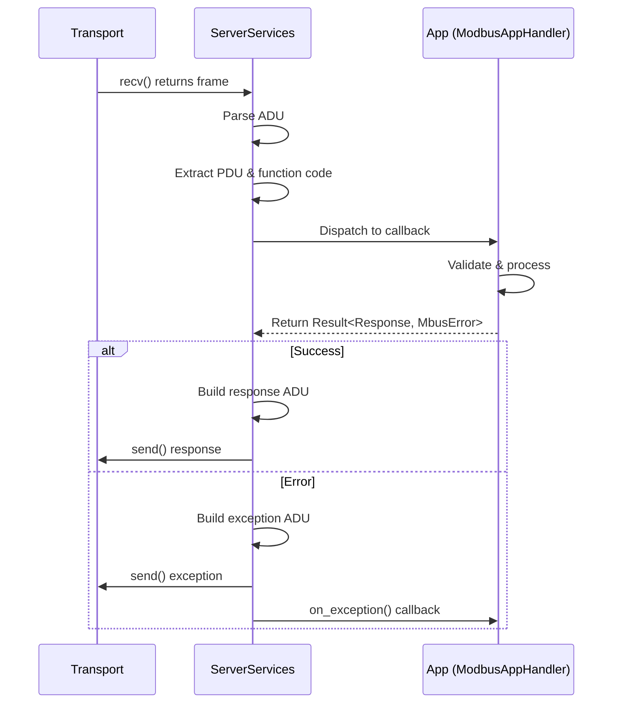

# Server Architecture

Understanding the internal design of the Modbus server stack.

---

## Overview

```
┌──────────────────┐      ┌─────────────────────┐       ┌──────────────────┐
│  Your App        │◀────▶│  ServerServices     │──────▶│  Transport       │
│                  │      │  (mbus-server)      │       │  (mbus-network / │
│  ModbusAppHandler│      │  request dispatch,  │       │   mbus-serial)   │
│  or #[modbus_app]│      │  retry queue,       │       └──────────────────┘
│                  │      │  timeout tracking   │
└──────────────────┘      └─────────────────────┘
                               │
                               ▼
                      ┌─────────────────────┐
                      │  mbus-core          │
                      │  protocol types,    │
                      │  ADU/PDU framing,   │
                      │  error model        │
                      └─────────────────────┘
```

---

## Design Principles

| Principle | Implementation |
|-----------|----------------|
| **No heap allocation** | All buffers use `heapless` with compile-time capacity |
| **No internal threads** | Progress driven entirely by `poll()` calls |
| **No blocking I/O** | Transport `recv()` is non-blocking |
| **Transport-agnostic** | Swap TCP/Serial/Mock via generic parameter |
| **no_std compatible** | Core library works on bare-metal |

---

## Crate Responsibilities

### `mbus-core`

- Protocol types: `FunctionCode`, `ExceptionCode`, `Pdu`, `Adu`
- Transport trait definition
- Config structs: `ModbusTcpConfig`, `ModbusSerialConfig`
- Error types: `MbusError`
- Wire encoding/decoding

### `mbus-server`

- `ServerServices` — request/response orchestrator
- `ModbusAppHandler` trait — callback interface
- Derive macros: `CoilsModel`, `HoldingRegistersModel`, etc.
- `modbus_app` procedural macro
- Retry queue for failed sends
- Priority queue (optional)

### `mbus-network`

- `StdTcpTransport` — TCP server transport

### `mbus-serial`

- `StdRtuTransport` — Serial RTU transport
- `StdAsciiTransport` — Serial ASCII transport

---

## Request Flow



---

## Dispatch Table

Function codes are dispatched to callbacks:

| FC | Callback | Feature |
|----|----------|---------|
| `0x01` | `read_coils_request` | `coils` |
| `0x02` | `read_discrete_inputs_request` | `discrete-inputs` |
| `0x03` | `read_multiple_holding_registers_request` | `holding-registers` |
| `0x04` | `read_input_registers_request` | `input-registers` |
| `0x05` | `write_single_coil_request` | `coils` |
| `0x06` | `write_single_register_request` | `holding-registers` |
| `0x07` | `read_exception_status_request` | `diagnostics` |
| `0x08` | `diagnostics_request` | `diagnostics` |
| `0x0B` | `get_comm_event_counter_request` | `diagnostics` |
| `0x0C` | `get_comm_event_log_request` | `diagnostics` |
| `0x0F` | `write_multiple_coils_request` | `coils` |
| `0x10` | `write_multiple_registers_request` | `holding-registers` |
| `0x11` | `report_server_id_request` | `diagnostics` |
| `0x14` | `read_file_record_request` | `file-record` |
| `0x15` | `write_file_record_request` | `file-record` |
| `0x16` | `mask_write_register_request` | `holding-registers` |
| `0x17` | `read_write_multiple_registers_request` | `holding-registers` |
| `0x18` | `read_fifo_queue_request` | `fifo` |
| `0x2B` | `read_device_identification_request` | `diagnostics` |

---

## Retry Queue

Failed `send()` calls are queued for retry:

```
┌─────────────────────────────────────────────────────────┐
│  Retry Queue (const generic capacity)                   │
│  ┌─────────┐ ┌─────────┐ ┌─────────┐ ┌─────────┐        │
│  │ Response│ │ Response│ │ Response│ │ Response│        │
│  │ Frame 1 │ │ Frame 2 │ │ Frame 3 │ │ Frame 4 │        │
│  │ retry=0 │ │ retry=1 │ │ retry=0 │ │ retry=2 │        │
│  │ ts=1000 │ │ ts=1050 │ │ ts=1100 │ │ ts=900  │        │
│  └─────────┘ └─────────┘ └─────────┘ └─────────┘        │
└─────────────────────────────────────────────────────────┘
```

- `max_send_retries` controls retry budget per response
- `response_retry_interval_ms` controls minimum delay between attempts
- Oldest responses are retried first
- Stale responses (past `request_deadline_ms`) are dropped

---

## Priority Queue (Optional)

When `enable_priority_queue = true`:

```
┌─────────────────────────────────────────────────────────┐
│  Priority Queue                                         │
│  ┌─────────────┐                                        │
│  │ Maintenance │  FC08, FC0B, FC0C, FC11, FC2B          │
│  ├─────────────┤                                        │
│  │ Write       │  FC05, FC06, FC0F, FC10, FC16, FC15    │
│  ├─────────────┤                                        │
│  │ Read        │  FC01, FC02, FC03, FC04, FC18, FC14    │
│  ├─────────────┤                                        │
│  │ Other       │  everything else                       │
│  └─────────────┘                                        │
└─────────────────────────────────────────────────────────┘
```

Higher priority requests are dispatched first, reducing I/O latency for critical operations.

---

## Derive Macro Architecture

```
┌─────────────────────────────────────────────────────────┐
│  #[derive(CoilsModel)]                                  │
│  struct MyCoils { ... }                                 │
│                    │                                    │
│                    ▼                                    │
│  Generated: impl CoilMap for MyCoils                    │
│  - encode(&self, range) -> Coils                        │
│  - decode(&mut self, coils)                             │
│  - addresses() -> &[u16]                                │
└─────────────────────────────────────────────────────────┘
                     │
                     ▼
┌─────────────────────────────────────────────────────────┐
│  #[modbus_app(coils(coils))]                            │
│  struct App { coils: MyCoils }                          │
│                    │                                    │
│                    ▼                                    │
│  Generated: impl ModbusAppHandler for App               │
│  - read_coils_request() { self.coils.encode(...) }      │
│  - write_single_coil_request() { self.coils.decode(..) }│
│  - on_write_X() hooks routed to App methods             │
└─────────────────────────────────────────────────────────┘
```

---

## Memory Layout

All internal buffers are stack-allocated:

| Buffer | Size | Notes |
|--------|------|-------|
| ADU frame | 260 bytes | 513 bytes with `serial-ascii` |
| Retry queue | `QUEUE_DEPTH * ~300 bytes` | Per pending response |
| Priority queue | Same | When enabled |
| Response buffer | 260 bytes | Shared |

---

## See Also

- [Building Applications](building_applications.md)
- [Policies](policies.md) — Timeout and queue configuration
- [Macros](macros.md) — Derive macro details
